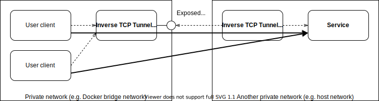

# Inverse TCP tunnel

## What is this?



Inverse TCP tunnel (ITT) is a TCP proxy that tunnels multiple connections to a service that sits in another private network and not directly accessible from the outside, with the help of the client agent that resides where it can get to the service.  Ordinary proxy servers deal with incoming connections by establishing corresponding ones to the upstream one by one. On the other hand, the ITT server multiplexes those incoming connections into a single TCP session with the client agent, and lets the client make actual connections to the upstream, hence the name "inverse."

This is pretty useful in the situation where you are using Docker and the docker daemon is listening on the unix domain socket that cannot be exposed to within the containers. (Docker Desktop for Mac, for example)

## Installation

For the server,

```
go get github.com/moriyoshi/inverse-tcp-tunnel/cmd/server
```

and for the client,

```
go get github.com/moriyoshi/inverse-tcp-tunnel/cmd/client
```

## Usage

The server program accepts these arguments:

```
Usage of server:
  -listen string
        address to listen (acceptor)
  -loglevel string
        loglevel (default "info")
  -tunnel string
        address to listen (tunnel)
```

* `-listen`

	Specifies the local address to listen on that accepts the connections from the user clients which want to connect to the service in the other network. Unix domain sockets can be specified by prefixing the path with `unix:`.

* `-loglevel`

	Specifies the log level.  The possible values are `fatal`, `error`, `warning`, `info`, `debug`, and `trace`.  Beware that setting this to `trace` will make the server to dump the raw network traffic.

* `-tunnel`

	Specifies the local address to listen on that accepts the connection from the client agent that reside where accessible to the service in question. Unix domain sockets can be specified by prefixing the path with `unix:`.

The client program accepts these arguments:

```
Usage of ./client:
  -downstream string
    	address to connect (downstream)
  -loglevel string
    	loglevel (default "info")
  -proxy string
    	proxy URL (e.g. socks5://localhost:1080)
  -upstream string
    	address to connect (upstream)
```

* `-downstream`

	Specifies the remote address where the ITT server is listening (the counterpart should have been configured with `-tunnel`). Unix domain sockets can be specified by prefixing the path with `unix:`.

* `-upstream`

	Specifies the remote address of the service in question. Unix domain sockets can be specified by prefixing the path with `unix:`.

* `-loglevel`

	Specifies the log level.  The possible values are `fatal`, `error`, `warning`, `info`, `debug`, and `trace`.  Beware that setting this to `trace` will make the server to dump the raw network traffic.

* `-proxy`

    Specifies another proxy to establish the connection with. Currently the following are supported:
    
    * `socks5://` (actually this works in the same way as `socks5h://`...)
    * `socks5h://`

## License

MIT
